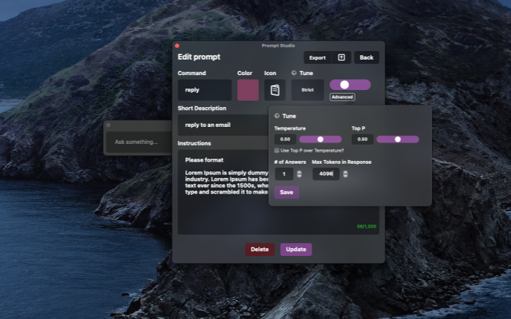
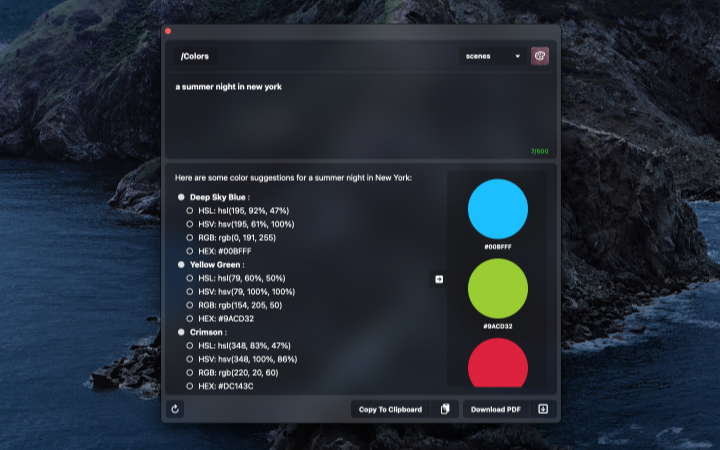

# Nea (macOS)

A SwiftUI macOS application to run local LLM models.

Currently, the project is set to point to personal local MLX models as default. A proper guide on setting up MLX and using MLX models with this application will come in the near future, [here](#setting-up-local-models) is a quick way to bootstrap your machine to get started.

The interface was inspired by one of my favorite applications [Alfred](https://en.wikipedia.org/wiki/Alfred_(software)) (or Spotlight search) and the templatization was inspired by [Raycast](https://www.raycast.com).

The future holds thoughts around prompt chaining and [time-series forecasting](https://github.com/riteshpakala/David).

General Query View           |  Prompt Studio
:-------------------------:|:-------------------------:
  | 

**Table of Contents**
- [Requirements](#requirements)
- [Setting Up Local Models](#setting-up-local-models)
- [Persisting Chat Messages](#persisting-chat-messages)
- [Guide WIP](#guide)
- [FAQ](#FAQ)
- [More Previews](#more-previews)
- [Swift Packages & Credits](#swift-packages-&-credits)

## Requirements

- `macOS 14.0+`

## Setting Up Local Models

The file [LLMModels.swift](https://github.com/riteshpakala/Nea/blob/main/Services/Sand/Models/LLMModels.swift), has some insight on how model configurations are prepared.

This file [LLMEvaluator.swift](https://github.com/riteshpakala/Nea/blob/main/Services/Sand/Client/LLMEvaluator.swift), shows how the configuration is called and used to load the model and eventually generate responses.

## Downloading Models from HuggingFace

1. Register a huggingface account and then setup the [huggingface cli](https://huggingface.co/docs/huggingface_hub/main/en/guides/cli)

2. Using [homebrew](https://brew.sh) is the easiest option to set this up. Make sure homebrew is allowed to be used as a package manager within your team before downloading.

3. Running `huggingface-cli login` in Terminal should prompt a handshake to authenticate.

4. To setup ssh, you can go into account settings and then the [SSH & GPG tab](https://huggingface.co/settings/keys). [GitHub](https://docs.github.com/en/authentication/connecting-to-github-with-ssh/generating-a-new-ssh-key-and-adding-it-to-the-ssh-agent) has a good guide on setting up ssh keys and agents. The similar approach can be applied here.

5. Install [git lfs](https://git-lfs.com), some of these models are quite large. When inside the folder you would like to clone repositories within, run `git lfs install` in terminal.

6. Once done, download a model like [mlx-community/DeepSeek-R1-Distill-Qwen-1.5B-4bit](https://huggingface.co/mlx-community/DeepSeek-R1-Distill-Qwen-1.5B-4bit) via `git clone https://huggingface.co/mlx-community/DeepSeek-R1-Distill-Qwen-1.5B-4bit`. This is a great starter model to experiment with, about 1Gb~.

7. Update the [LLMModels.swift](https://github.com/riteshpakala/Nea/blob/main/Services/Sand/Models/LLMModels.swift) file to reflect your path and finally, ask a question.

## Persisting Chat Messages
> Repo will be updated to include this out of the box, front-end side, in the future.

Simply build a flow to store the type `ChatMessage` prior to using the Swift Package.

```swift
private var messages: [ChatMessage] = []
    
func ask<E: EventExecutable>(_ prompt: String,
                             withSystemPrompt systemPrompt: String? = nil,
                             withConfig config: PromptConfig,
                             stream: Bool = false,
                             logMessages: Bool = false,
                             event: E) {
```

Append the user prompt with the role `user`.

```swift
self.messages.append(.init(role: .user, content: prompt)) //add user prompt
```

Append the chat-bot's response with the role `assistant`.
```swift
reply = try await client.ask(messages: self?.messages ?? [],
                                                         withConfig: config)
                            
DispatchQueue.main.async { [weak self] in
    self?.isResponding = false
}
    
if logMessages {
    self?.messages.append(.init(role: .assistant, content: reply))
}
    
event.send(Response(data: reply, isComplete: true, isStream: false))
```

The role `.system` is good for setting a persona prior to message collection.

```swift
self?.messages.append(.init(role: .system, content: "Act as..."))
```

Linking the reset() function in `SandGPT()` to clear messages is helpful too:

```swift
func reset(messages: Bool = false) {
    self.currentTask?.cancel()
    self.reqDebounceTimer?.invalidate()
    self.replyCompletedTimer?.invalidate()
    self.isResponding = false
    
    if messages {
        self.messages = []
    }
}
```    
                           

## Guide

### [PaneKit](https://github.com/pexavc/Nea/tree/main/Services/Environment/Models/PaneKit)
- Window resizing and size management occurs here.

Declaritevly update a single window's size whenever an action requires 

```swift
state.pane?.display {
    WindowComponent(WindowComponent.Kind.query)
    
    if addResponse {
        WindowComponent(WindowComponent.Kind.divider)
        
        WindowComponent(WindowComponent.Kind.response)
        
        WindowComponent(WindowComponent.Kind.spacer)
        
        WindowComponent(WindowComponent.Kind.shortcutbar)
    }
}
```

### [InteractionManager](https://github.com/pexavc/Nea/blob/main/Services/Environment/Models/InteractionManager.swift)
- Popups and Hotkey observation/registration

Example of Using PopupableView to easily trigger popups in any window instance.

```swift
PopupableView(.promptStudio,
              size: .init(200, 200),
              edge: .maxX, {
    RoundedRectangle(cornerRadius: 6)
        .frame(width: 60, height: 60)
        .foregroundColor(Color(hex: promptColor))
}) {
    ColorPicker(hex: $promptColor)
}
.frame(width: 60, height: 60)
```

## FAQ

`wip`

## More Previews

Advanced Tuning           |  Helper Tab
:-------------------------:|:-------------------------:
 | 

Using Commands           |  Switching Commands
:-------------------------:|:-------------------------:
 | 

## Swift Packages & Credits

- [Granite](https://github.com/riteshpakala/Granite)
- [SandKit](https://github.com/riteshpakala/SandKit)
- [VaultKit](https://github.com/pexavc/VaultKit)
- [SwiftGPT](https://github.com/SwiftedMind/GPTSwift) by [@SwiftedMind](https://github.com/SwiftedMind)
- [GPT3-Tokenizer](https://github.com/aespinilla/GPT3-Tokenizer) by [@aespinilla](https://github.com/aespinilla)
- [swiftui-markdown](https://github.com/jaywcjlove/swiftui-markdown) by [@jaywcjlove](https://github.com/jaywcjlove)
- [Ink](https://github.com/JohnSundell/Ink) by [@JohnSundell](https://github.com/JohnSundell)
- [LaunchAtLogin](https://github.com/sindresorhus/LaunchAtLogin) by [@sindresorhus](https://github.com/sindresorhus)
- [PureSwiftUI](https://github.com/CodeSlicing/pure-swift-ui) by [@Brett-Best](https://github.com/Brett-Best)
- Some of these initial designs were provided by [Dustin Simantob](https://www.linkedin.com/in/dustinsimantob).

### Removed

- [MarqueKit] is a private repo that handles encryption this has been removed and comments show where encryption can take place to safely store data like API Keys.
