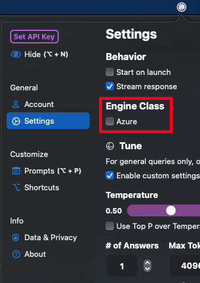

# Nea (macOS)

A SwiftUI macOS application to run local LLM models. Started as a GPT/LLM Client with Prompt Engineering support with Microsoft's Azure OpenAI functionality. But, slowly migrating to local only. The migration process is currently a work in progress.

Currently, the project is set to point to local MLX models as default. A proper guide on setting up MLX and using MLX models with this application will come in the near future.

Some of these initial designs were provided by [Dustin Simantob](https://www.linkedin.com/in/dustinsimantob). Although, the interface was mostly inspired by one of my favorite applications [Alfred](https://en.wikipedia.org/wiki/Alfred_(software)) (or Spotlight search) and the templatization was inspired by [Raycast](https://www.raycast.com).

The future holds thoughts around prompt chaining and time-series forecasting.

General Query View           |  Prompt Studio
:-------------------------:|:-------------------------:
  | 

**Table of Contents**
- [Requirements](#requirements)
- [Swift Packages & Credits](#swift-packages-&-credits)
- [Setting Up Azure OpenAI](#setting-up-azure-openai)
- [Persisting Chat Messages](#persisting-chat-messages)
- [Guide WIP](#guide)
- [FAQ](#FAQ)
- [More Previews](#more-previews)
- [TODO](#TODO)

## Requirements

- `macOS 14.0+`  ***Build passing*** 🟢

## Swift Packages & Credits

- [Granite](https://github.com/riteshpakala/Granite)
- [SandKit](https://github.com/riteshpakala/SandKit)
- [VaultKit](https://github.com/pexavc/VaultKit)
- [SwiftGPT](https://github.com/SwiftedMind/GPTSwift) by [@SwiftedMind](https://github.com/SwiftedMind)
- [GPT3-Tokenizer](https://github.com/aespinilla/GPT3-Tokenizer) by [@aespinilla](https://github.com/aespinilla)
- [swiftui-markdown](https://github.com/jaywcjlove/swiftui-markdown) by [@jaywcjlove](https://github.com/jaywcjlove)
- [Ink](https://github.com/JohnSundell/Ink) by [@JohnSundell](https://github.com/JohnSundell)
- [LaunchAtLogin](https://github.com/sindresorhus/LaunchAtLogin) by [@sindresorhus](https://github.com/sindresorhus)
- [PureSwiftUI](https://github.com/CodeSlicing/pure-swift-ui) by [@Brett-Best](https://github.com/Brett-Best)

Removed
- [MarqueKit] is a private repo that handles encryption this has been removed and comments show where encryption can take place to safely store data like API Keys. 

## Setting Up Azure OpenAI
1. Enable Azure in Settings



2. [In SandGPT, setup the config to match your Azure OpenAI Resource/Deployment/ApiKey](https://github.com/pexavc/Nea/tree/main/Services/Sand/Client/SandGPT.swift#L36-L40)

```swift
static var AZURE_CONFIG: ChatGPTAzure.Config {
    .init(apiKey: "...",
          apiVersion: "2023-05-15", //apiVersion not necessary for initialization
          resourceName: "...",
          deploymentName: "...")
}
```

## Persisting Chat Messages
> Repo will be updated to include this out of the box, front-end side, in the future.

Back in SandGPT: 
https://github.com/pexavc/Nea/blob/24fbcfbac23eb7f13b84cdee6307211596ee54d0/Services/Sand/Models/SandGPT.swift#L48

Simply build a flow to store the type `ChatMessage` prior to using the Swift Package.

```swift
private var messages: [ChatMessage] = []
    
func ask<E: EventExecutable>(_ prompt: String,
                             withSystemPrompt systemPrompt: String? = nil,
                             withConfig config: PromptConfig,
                             stream: Bool = false,
                             logMessages: Bool = false,
                             event: E) {
```

Append the user prompt with the role `user`.

```swift
self.messages.append(.init(role: .user, content: prompt)) //add user prompt
```

Append the chat-bot's response with the role `assistant`.
```swift
reply = try await client.ask(messages: self?.messages ?? [],
                                                         withConfig: config)
                            
DispatchQueue.main.async { [weak self] in
    self?.isResponding = false
}
    
if logMessages {
    self?.messages.append(.init(role: .assistant, content: reply))
}
    
event.send(Response(data: reply, isComplete: true, isStream: false))
```

The role `.system` is good for setting a persona prior to message collection.

```swift
self?.messages.append(.init(role: .system, content: "Act as..."))
```

Linking the reset() function in `SandGPT()` to clear messages is helpful too:

```swift
func reset(messages: Bool = false) {
    self.currentTask?.cancel()
    self.reqDebounceTimer?.invalidate()
    self.replyCompletedTimer?.invalidate()
    self.isResponding = false
    
    if messages {
        self.messages = []
    }
}
```    
                           

## Guide

### [PaneKit](https://github.com/pexavc/Nea/tree/main/Services/Environment/Models/PaneKit)
- Window resizing and size management occurs here.

Declaritevly update a single window's size whenever an action requires 

```swift
state.pane?.display {
    WindowComponent(WindowComponent.Kind.query)
    
    if addResponse {
        WindowComponent(WindowComponent.Kind.divider)
        
        WindowComponent(WindowComponent.Kind.response)
        
        WindowComponent(WindowComponent.Kind.spacer)
        
        WindowComponent(WindowComponent.Kind.shortcutbar)
    }
}
```

### [InteractionManager](https://github.com/pexavc/Nea/blob/main/Services/Environment/Models/InteractionManager.swift)
- Popups and Hotkey observation/registration

Example of Using PopupableView to easily trigger popups in any window instance.

```swift
PopupableView(.promptStudio,
              size: .init(200, 200),
              edge: .maxX, {
    RoundedRectangle(cornerRadius: 6)
        .frame(width: 60, height: 60)
        .foregroundColor(Color(hex: promptColor))
}) {
    ColorPicker(hex: $promptColor)
}
.frame(width: 60, height: 60)
```

## FAQ

### Why chat completions over completions for prompts?
- No specific reason besides, finding it to provide better results for my own needs.
- Completions endpoint capability will be added soon along with a toggle to switch between.

## More Previews

Advanced Tuning           |  Helper Tab
:-------------------------:|:-------------------------:
 | 

Using Commands           |  Switching Commands
:-------------------------:|:-------------------------:
 | 


## TODO

- [ ] Clean up Online support, migrate to local models only.
